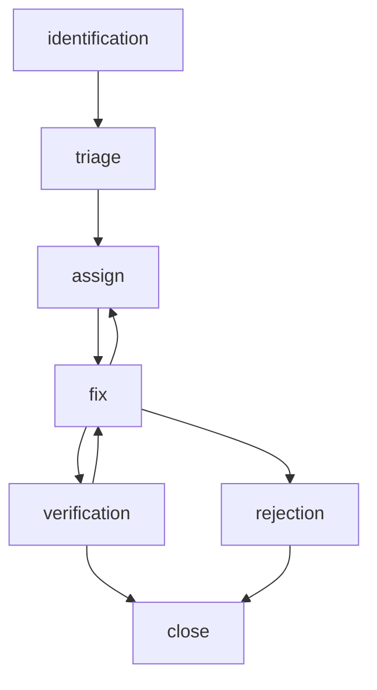

# Test Team Organization Study Guide

## Testing Team

### Test Manager
The **Test Manager** is responsible for overseeing the entire testing process, ensuring that it aligns with the project’s goals and quality standards. They develop test strategies, manage the testing team, and coordinate with other departments. Additionally, they ensure testing resources are effectively utilized, making sure the testing process is efficient and thorough

### Tester
**Testers** identify defects by executing tests. They ensure that the software functions as expected and meets specified requirements. Their key tasks include writing and executing test cases, reporting bugs, and verifying fixes. **Testers** often work closely with developers to understand the software and its potential issues, which helps contribute to the overall quality of the product

### Business Analyst
**Business Analysts** act as a bridge between the business and technical teams. They usually have a good business understanding and technical knowledge, which helps them to analyze documentation and requests from both the business and technical teams. If there is a misunderstanding between the business and technical teams it is the job of the **Business Analysts** to help clarify and clear the misunderstandings and blockers

### Stakeholder
**Stakeholders** represent the interests of those who have a stake in the project, such as customers, users, or management. They provide input on requirements and feedback on the software’s performance. Their responsibilities include reviewing test results, providing feedback, and making decisions based on the testing outcomes. **Stakeholders** ensure that the software meets the needs and expectations of its intended users

## Testing Life Cycle

### Phase 1 - Requirement Analysis
The initial phase of the **Software Testing Life Cycle (STLC)** is the **Requirement Analysis Phase**. During this phase, the test team examines the software requirements to ascertain the scope of testing. This involves identifying both functional and non-functional requirements. Key activities in this phase include:
- **Requirement Review**: Thoroughly reviewing the software requirements documentation to understand the expected functionalities and performance criteria
- **Stakeholder Discussions**: Engaging with stakeholders, including business analysts, developers, and clients, to clarify any ambiguities and gather additional details
- **Feasibility Study**: Assessing the feasibility of the requirements from a testing perspective, identifying any potential challenges or constraints
- **Requirements Traceability Matrix (RTM)**: Developing an RTM to ensure that all requirements are covered by test cases. This matrix helps in tracking the requirements throughout the testing process and ensures comprehensive test coverage

By the end of this phase, the test team should have a clear understanding of what needs to be tested and a strategy for how to approach the testing process

### Phase 2 - Test Planning
The **Test Planning Phase** comes after **requirement analysis**. During this phase, a Testing Manager or a senior team member is responsible for drafting a comprehensive test plan. This plan outlines the testing strategy, objectives, resources, schedule, and scope of the testing activities. Key activities in this phase include:
- **Test Plan Development**: Crafting a detailed test plan document that defines the testing approach, including the types of tests to be performed, testing levels, and the testing environment
- **Effort and Cost Estimation**: Calculating the level of effort required and estimating the costs associated with the testing activities. This includes resource allocation, tool costs, and any other expenses
- **Resource Planning**: Identifying and assigning the necessary resources, such as testing tools, hardware, software, and personnel, to ensure the testing process runs smoothly
- **Risk Analysis**: Identifying potential risks and limitations that could impact the testing process and developing mitigation strategies
- **Scheduling**: Establishing a detailed testing schedule, including timelines for each testing activity, milestones, and deadlines

By the end of this phase, the test team should have a well-defined test plan that serves as a roadmap for the subsequent testing phases

### Phase 3 - Test Case Design

The **Test Case Design Phase** is where the test team focuses on creating detailed test cases and organizing necessary test data based on the established test plan. Key activities in this phase include:
- **Test Case Creation**: Developing comprehensive test cases that cover all functional and non-functional requirements. Each test case should include clear steps, expected results, and acceptance criteria where necessary
- **Test Script Development**: Writing automated test scripts, if applicable, to facilitate efficient and repeatable testing processes
- **Test Data Preparation**: Generating or identifying the required test data to ensure that all test scenarios can be executed
- **Review and Refinement**: Conducting peer reviews and walkthroughs of the test cases and scripts to ensure accuracy, completeness, and alignment with the product requirements, refactoring the test cases as needed based on feedback
- **Parallel Activities**: This phase can be executed in parallel with the Test Environment Setup phase to optimize the testing schedule and ensure readiness for the subsequent testing phases

By the end of this phase, the test team should have a robust set of test cases and scripts that are ready for execution

### Phase 4 - Test Environment Setup

The **Test Environment Setup Phase** is where the test team establishes the software and hardware environments that closely replicate the production conditions of the work product. Key activities in this phase include:
- **Environment Configuration**: Setting up the required software, hardware, network configurations, and other necessary components to create a test environment that mirrors the production environment
- **Environment Validation**: Verifying that the test environment is correctly configured and functioning as expected. This includes checking for any discrepancies that could impact the accuracy of the test results
- **Tool Installation**: Installing and configuring any testing tools and frameworks needed for test execution
- **Data Setup**: Ensuring that the necessary test data is available and correctly loaded into the test environment
- **Parallel Execution**: This phase can be conducted in parallel with the Test Case Development Phase to optimize the testing schedule and ensure that the environment is ready when the test cases are finalized

By the end of this phase, the test team should have a fully functional test environment that is ready for the execution of test cases

### Phase 5 - Test Execution

The **Test Execution Phase** is where the actual testing takes place. During this phase, testers execute the developed test cases to validate the functionality and performance of the software product. Key activities in this phase include:
- **Test Script Execution**: Running the test scripts and manually executing test cases as per the test plan
- **Script Maintenance**: Updating and maintaining test scripts to accommodate any changes in the software or test environment
- **Bug Reporting**: Identifying and logging defects or issues found during test execution. This involves documenting the steps to reproduce the issue, the expected and actual results, and any relevant screenshots or logs
- **Retesting**: Re-executing test cases that previously failed after the defects have been fixed to ensure that the issues have been resolved
- **Regression Testing**: Performing regression tests to verify that recent changes have not adversely affected existing functionalities
- **Report Generation**: Compiling test execution reports that summarize the testing activities, including the number of test cases executed, passed, failed, and any defects identified. These reports provide insights into the quality of the software and help stakeholders make informed decisions

By the end of this phase, the test team should have a clear understanding of the software's quality and readiness for release, based on the test results and identified issues

### Phase 6 - Test Cycle Closure

The **Test Cycle Closure Phase** is the final stage of the **STLC**. This phase signifies the completion of test execution and involves several wrap up activities. Key activities in this phase include:
- **Test Cycle Review**: Conducting a comprehensive review meeting with the test team and stakeholders to discuss and analyze the test execution reports, defect logs, and other testing artifacts
- **Metrics and Reporting**: Compiling and presenting key metrics and reports that provide insights into the testing outcomes, such as test coverage, defect density, and test execution status
- **Lessons Learned**: Identifying successful strategies, best practices, and areas for improvement based on the experiences and outcomes of the test cycle. Documenting these lessons to enhance future testing efforts
- **Test Artifacts Archival**: Organizing and archiving all test artifacts, including test cases, test scripts, defect reports, and test execution logs, for future reference
- **Test Environment Teardown**: Decommissioning the test environment and releasing any resources that were allocated for testing
- **Sign-off**: Obtaining formal sign-off from stakeholders, indicating that the testing phase is complete and the software is ready for release or further stages of development

By the end of this phase, the test team should have documented insights that can be leveraged for continuous improvement in future projects

## Defect Life Cycle
[Baledung has a nice writeup of the defect Life Cycle](https://www.baeldung.com/cs/defect-life-cycle-testing)

### Defect Identification
In the **Defect Identification** phase, actions include detecting and logging the defect during code reviews, testing, or by end-users. The defect is documented with relevant data, such as steps to reproduce, screenshots, and logs, ensuring it is logged into a defect tracking system with all necessary information

### Categorization & Prioritization
During the **Defect Categorization and Prioritization** phase, actions involve assessing the defect's severity (e.g., critical, major, minor) and priority (e.g., high, medium, low) based on user impact, frequency, and business importance. This helps in categorizing and prioritizing the defect for the resolution process

### Assignment
In the **Defect Assignment** phase, the project manager or lead developer reviews the defect and assigns it to the appropriate team or individual with the necessary expertise, along with a tentative timeline for resolution

### Analysis & Planning
The **Defect Analysis and Planning** phase involves analyzing the defect to understand its root cause by reviewing the code, reproducing the defect, and identifying the underlying issue. Planning the fix, estimating the effort required, and determining the impact on other parts of the system are also part of this phase

### Fixing
The **Defect Fixing** phase involves the actual coding work to fix the defect takes place. Actions include modifying the code, performing unit tests, and ensuring that the fix does not introduce new defects. Should the tester/testing team be unable to fix the defect it may be reassigned. Similarly, if the tester is unable to recreate the defect, or any other blocker occur, the defect can be **rejected** and either be returned to the backlog of defects or removed from the list, depending on the blocker (think a  "it's not a bug, it's a feature" moment)

### Verification
In the **Defect Verification (Verify)** phase, actions involve retesting the defect in the same environment where it was originally found and conducting regression testing to ensure no new issues have been introduced. This phase verifies the defect fix and confirms that the system is stable

### Closure
During the **Defect Closure (Close)** phase, the defect tracking system is updated to reflect the closure, stakeholders are informed, and any lessons learned are documented. This formal closure of the defect in the tracking system is communicated to all relevant parties

### Defect Life Cycle Simplified Flowchart

## Test Documentation

### Test Plan
A **test plan** is a comprehensive document that outlines how a team will manage testing for a product or system, including details such as the objectives, schedule, estimates, and deliverables of a project. This document serves as a central hub, specifying the need for other documents such as the test case document and the requirements traceability matrix. It is sometimes referred to as a "master test plan", "level test plan", or "test scope". Ultimately, the **Test Plan** is meant to coordinate testing activities effectively, ensuring that all aspects of the testing process are covered and aligned with the overall goals of the project

### Test Schedule
A **test schedule** is a document that outlines the timeline for completing various testing activities. It specifies when each part of the software needs to be tested in order to facilitate timely testing. In an Agile development environment, this schedule is a living document, meaning it is continuously updated and adjusted as the project progresses. This flexibility allows the team to adapt to changes and unforeseen challenges, ensuring that testing remains aligned with the overall project timeline. The **test schedule** also helps in coordinating efforts across different teams, preventing bottlenecks and ensuring that resources are allocated efficiently. Maintaining a well-structured test schedule can help ensure that all critical aspects of the test objects are tested, which makes it easier to handle unexpected problems when they arise

### Requirement Traceability Matrix
A **requirements traceability matrix** (RTM) is a document that visualizes the relationship between System Requirements/User Stories, acceptance criteria, and the Test Cases that cover those requirements. It can also track any defects revealed after testing. This means the **RTM** maps requirements to their specific test cases, which helps with maintaining traceability and ensuring comprehensive test coverage

### Software Requirements Specification
A **software requirements specification** (SRS) document is a detailed and structured description of the software system to be developed. It serves as a comprehensive guide for both the development team and stakeholders, outlining the **functional** and **non-functional requirements** of the software. The core of the **SRS** is the **functional requirements** section, which specifies the specific behaviors or functions the software must perform. Additionally, the **non-functional requirements** section covers performance, security, usability, and other quality attributes the software must meet. The document also includes external interface requirements, specifying how the software will interact with other systems or hardware, and design constraints, listing any limitations or constraints that affect the design or implementation. An **SRS** is crucial for ensuring clarity and alignment among all stakeholders, providing a blueprint for the development team, and serving as a **test basis** to the testing team

### Test Progress Report
A **test progress report** is a document used to track the progress of tests designed and executed, providing a clear overview of testing activities. This report works in conjunction with the Test Schedule by providing detail on the status of the various tests completed and in progress. It includes details such as the number of test cases executed, passed, failed, and any defects identified during the testing process. By maintaining an up-to-date Test Progress Report, teams can monitor their progress, identify any bottlenecks or issues early, and make informed decisions

### Test Summary
A **test summary report** is a document used to aggregate and display the results of test case executions associated with one or more test objects. Partial reports may be included in a **test progress report**, but the entirety of the test results should be saved in their own documentation. Typical **test summary reports** are organized by test runs or test cycles: this is a way of distinguishing the results of the test cases between development/testing cycles. **Test summary reports** include similar information to a **test progress report**: test cases executed, status of test cases, and defects identified during testing. These reports are often generated at different milestones and are consulted when determining whether development and testing should progress