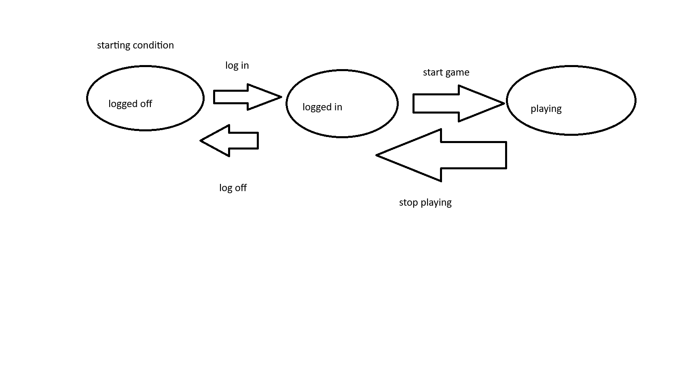

# Test Case Creation

## How do we know we have sufficiently tested our features?
What are some strategies we can use in order to be confident we have sufficiently performed our testing?
- Consider the kind of testing we are doing:
    - Unit testing? We should expect to have a very large number of tests. If we only have a few tests, it is probably insufficient
    - System testing? We should expect to have some tests, but not an overly large collection. If our test collection is very large with lots of test data that is basically the same, then it is probably safe to assume we have redundant tests
- Consider your test environment
    - **Do you have access to the source code?**
    - Are you doing functional testing?
    - Are you doing static testing?
    - Are you doing manual testing?
    - etc.

## Black Box Testing
- If you don't have access to the inner workings of an application (aka the source code) you are doing "Black Box" testing. This type of testing is common (especially for manual testing) and has some well documented strategies for creating test data and organizing test scenarios
    - test data: the inputs used during your tests (think your valid/invalid data)
    - test scenarios: a sequence of actions that constitutes a "test" (think going through your acceptance criteria step by step to validate things work as expected)

### Boundary Value Analysis
- anytime you have a requirement that provides natural "boundries" you can do boundary value analysis
- this is where you look at the minimum and maximum values(typically some kind of numeric value) and organize your test data accorrdingly, ususally with 4 pieces of data:
    - just under the minimum value as negative data
    - just on the minimum boundary as positive data
    - just on the maximum boundary as positive data
    - just over the maximum boundary as negative data

|just lower than requirements|just within lower requirements|just within upper requirements|just above requirements|
|-|-|-|-|
|bobb|bobby|thisshouldbethirtycharactersss|thisoverthirtycharacterssssssss|

- In this example table of valid and invalid test data, the categories that are above and below the boundary of the requirement are representing the "class" of data
    - "bobb" is representing all possible values that are less than 5
    - "thisoverthirtycharacterssssssss" is representing all possible values that are larger than 30
    - At the end of the day, testers will need to make assumptions at some point: we will have to assume that a feature works as intended even if we have not passed all possible values through our tests (it is not feasible to pass ALL possible values above 30 through our tests: there is an infinite number of possibilities)

### Equivalence Paritioning
- Similar to Boundary Value Analysis, Equivalence Partitioning is a strategy of having a single value represent an entire class of data that does not have a "natural" boundary.

|unique|not unique|
|-|-|
|Robin|Batman|

- Keep in mind when creating your valid data, even if you are only checking for 1 requirement, your data should meet all requirements, otherwise your tests may fail for unexpected reasons
    - this is particularly important for system testing, where we expect all requirements to be enforced
    - if this was a lower level of testing, like integration or unit testing, this may not be a concern
- When doing system testing, it is ok to combine requirement validation into your individual test data, but if time allows, it is always better to have more modular tests in order to isolate the root cause of a defect

### State Transition Diagram
- State Transition Diagram is meant to provide a visual representation of state within an application
- the valid transitions from state to state should be represented
- the benefit of a state transition diagram is how it lays out what the valid and invalid state transitions are: this informs testers of what kind of actions should be valid and when they are valid. Sad path testing would include trying to change from one state to another in an invalid way
    - in the paint example, an invalid transition according to the diagram is going from being logged off to playing directly: tests should be created to validate this is not possible

## Writing actual test scenarios
Just having test data is not enough: it must be organized in meaningful ways in order to create meaningful "test scenarios". A test scenario is simply a collection of data, actions, and expected results. This is also known as a "test case". there are some common ways of organizing data/actions in order to create test scenarios

### Decision Table
A decision table takes a collection of input data (actual data, actions, etc) and based on the collection of data, we list the expected results of actions taken with that input data

|username|password|registration result|
|-|-|-|
|valid|valid|success|
|invalid|valid|fail|
|valid|invalid|fail|
|invalid|invalid|fail|

the decision table above shows us that we have four test scenarios we can automate, one is a happy path scenario, the other three are sad path scenarios