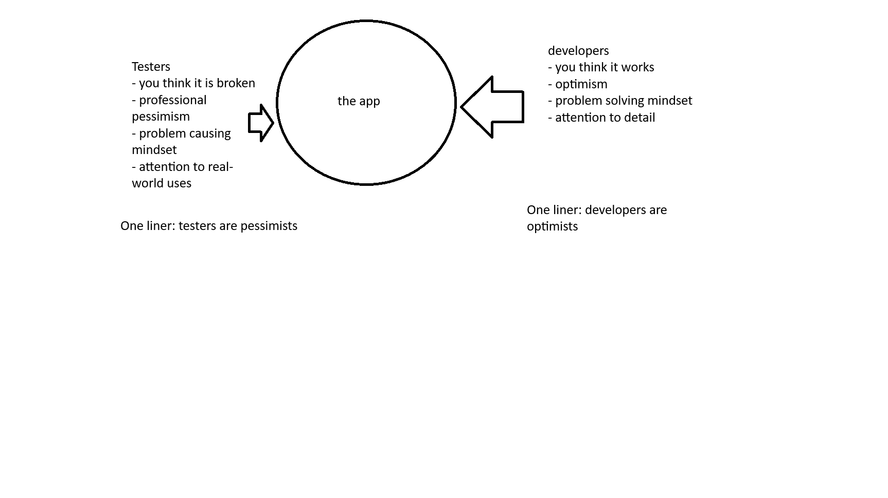

# What is testing?
- does QA = Testing?
    - yes and no

# Differing Paradigms

# Quality Management
- Devs are optimists
- Testers are pessimists
- How do we keep the two unified and not in tension?
- Quality Management is the solution

# QM Broken Down
- Quality Management has two subsets: Quality Control and Quality Assurance

## Quality Control
- Quality Control is product-oriented and corrective
    - works directly with "the app" and is focused on finding/fixing problems with "the app"
    - this will be our primary focus during training 
- the big idea: find and fix problems to make a good product
- One Liner: QC is about solving problems
- example: writing tests to validate code returns expected results

## Quality Assurance
- Quality Assurance is process-oriented and preventative
    - works with resources that are auxiliary to "the app"
        - documentation
        - workflows
        - test data
- the big idea: good process leads to a good product
- One Liner: QA is about preventing problems
- example: reviewing sprint workflow to verify all activities produce meaningful work artifacts

# Verification & Validation
- All QC will answer one of two questions:
    1. Are we building the product correctly?
    2. Are we building the right product?
- Question 1 is what we call "Verification"
    - consider we are building a social media application:
        - users should be able to register
        - log in
        - make posts
        - upload photos
        - etc
    - "Verification" is the process of "verifying" the correct features/resources/requirements of the product are present
    - "static testing" is typically done to perform "Verification"
        - Static testing is testing done without a running application
            - looking over source code
            - reviewing requirements
            - checking with stakeholders that features are correct
- Question 2 is what we call "Validation"
    - it does not matter how good our app is if it is not what the stakeholders actually asked for
    - "dynamic testing" is testing done with a running application
        - going back to the bike example, if we were to "validate" the bike works correctly, say for a cross country trip the client wants to take, we would quickly realize a regular bike is not suitable for the use case the client has
- Verification one liner: verification is testing an application and its auxiliary resources without the app running
- Validation one liner: validation is testing an application and auxiliary resources with the app running
    - training will primarily be focused on validation activities

# How do you know if you are doing QA/QC/Verification/Validation?
- In the same way developers know what the API/Service/Repository layer of the application should do through the documentation and conversations had with stakeholders, Testers use the same resources to determine what the "requirements" are for the application that need to be tested

# Requirements
- Business Logic handled in the service layer == Requirement
- API specifications (routes, data in requests/responses, status codes, etc) == Requirement
- Repository queries and result sets returned == Requirement
- some common forms requirements take
    - software requirement specification documentation
    - use cases
    - user stories
    - converation with stakeholder
    - requirement traceability matrix
    - etc.

# How do we talk about "problems" in a technical sense?
- if anything unexpected happens in your testing, you have **discovered a "defect"**
    - any deviation, no matter how big or small, from the expected, is a defect
- if something unexpected happens (aka defect is discovered) while the application is running (this can be during a test, an end user using the application, etc.) this is called a "failure"
    - this means all failures are defects, but not all defects are failures
- if a defect is discovered but it is due to our mistake we classify it as an "error"
- In essence, we are answering the question "Is this a problem with the application, or is it a problem with our code?"
    - did we write a bad test? That's an "error"
    - did the application not work correctly? That's a "failure"

# Automated vs Manual Testing
- Automated testing is having software test for you
    - require creation by testers
    - requires technical knowledge
        - knowing how to code
        - understand the tech stack
    - slow to start, but ends up being more quickly completed than manual testing in the long run
    - not subject to human error when repeating actions
        - not subject to fatigue/distraction like people are
    - particularly useful for dynamic testing
- Manual testing is performing the testing yourself
    - slower than automated testing
    - still superior to automated testing when the test results are subjective in nature
        - is the application pleasing to look at
        - is the application intuitive to use
        - Does the application "flow" naturally
        - think "does interpreting the test result require giving an opinion rather than validating a fact?" If the answer is yes, then manual testing is propably a better choice than automated testing
    - unlike automated testing, which takes a long time to get started, manual testing can be started by non-technical individuals right away
        - this type of testing is fine for smaller features/applications, but it does not scale well

In short, manual testing is still excellent for subjective tests, automated testing should be preferred when possible for tests with clear-cut pass/fail results

# Test Objective & Test Object
- Test Condition = determined from one or more test basis, describes from a high level perspective what testing needs to be done
- Test Objective = determined through a combination of requirements, test conditions, and project scope. Test Objectives are "low level" or specific goals for testing

one liner: test conditions are high level/broad descriptions of the testing that needs to be done, and Test Objectives are low level/detailed descriptions of the testing that needs to be done

# Happy Path vs Sad Path
- Happy Path / Positive Testing
    - testing done with "valid" input
        - "valid" input is any data/action included during a test that conforms itself to all requirements
    - testing in the following way: "given valid input, the expected output is achieved"
- Sad Path / Negative Testing
    - testing done with "invalid" input
        - "invalid" input is any data/action included during a test that does not conform itself to all requirements
            - this can be one or more requirements that are not followed
    - testing in the following way: "given invalid input, the expected output is achieved"